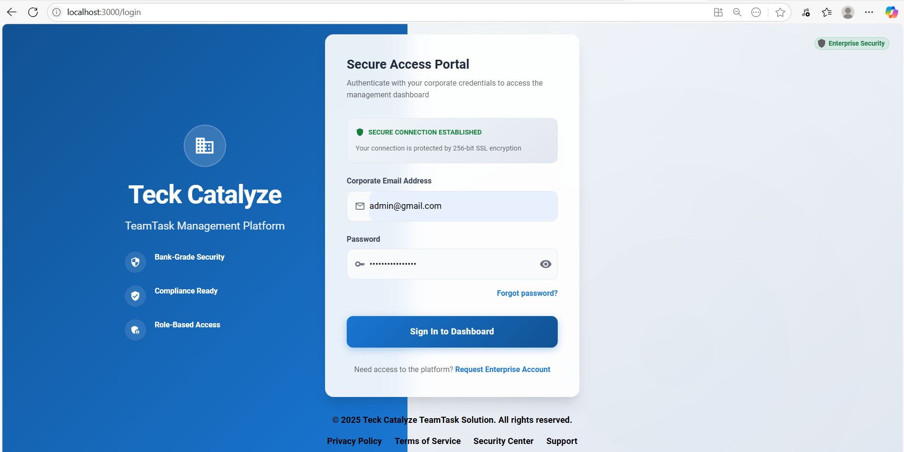
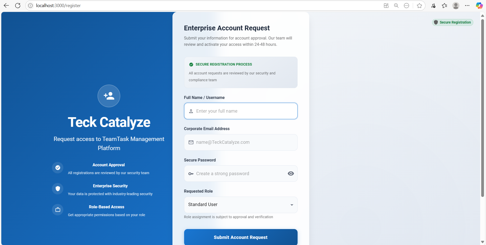
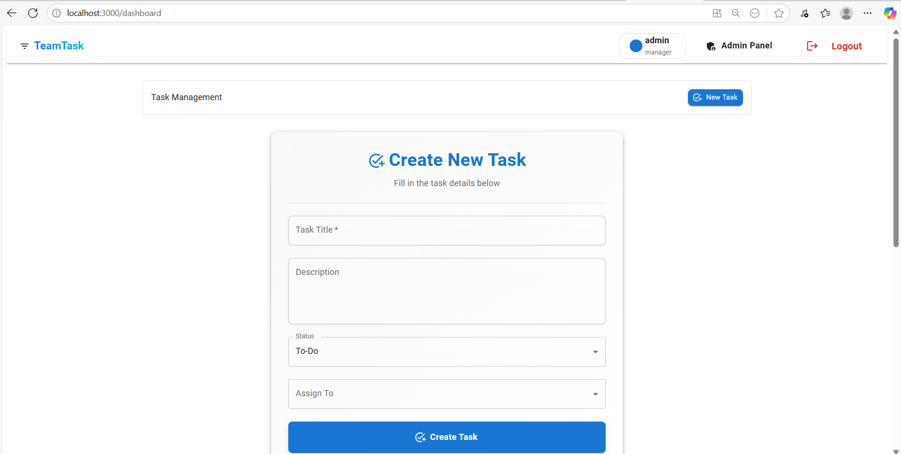
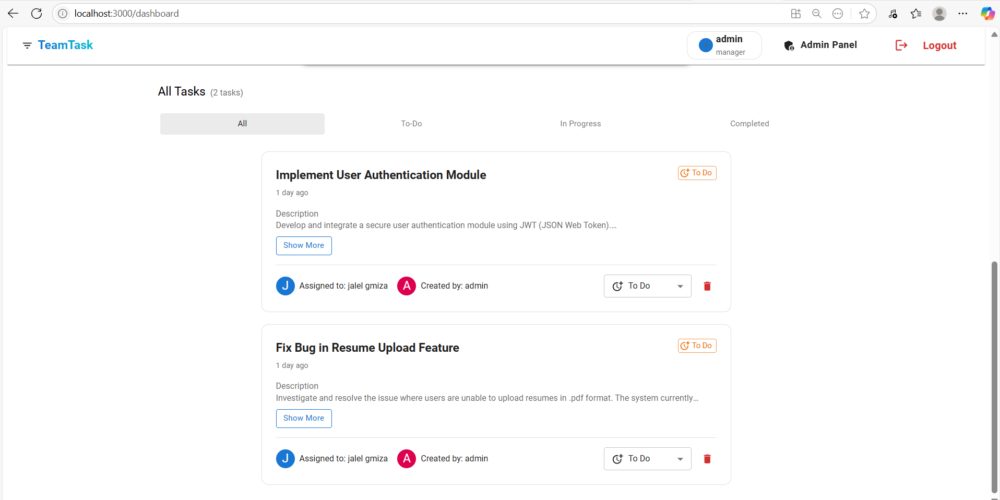
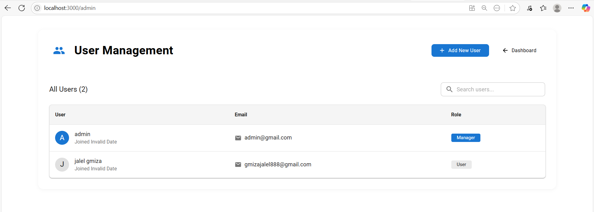
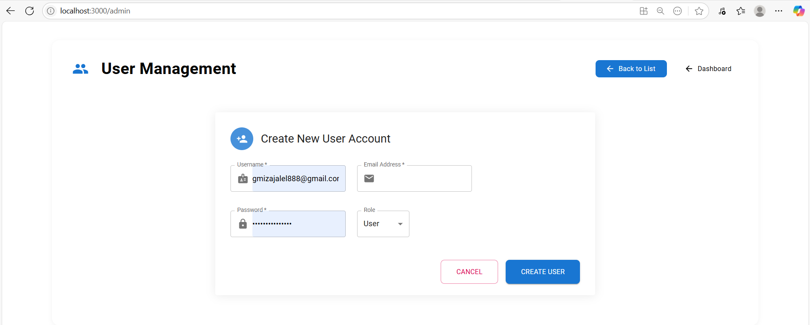

# TeamTask

A MERN stack application for task management with role-based access control, built with Node.js, Express.js, MongoDB, React, Redux Toolkit, and Material-UI.

## Features
- **Authentication**: Secure JWT-based authentication with access and refresh tokens stored in localStorage.
- **Role-Based Access**:
  - **User**: View and update status of their own tasks.
  - **Manager**: Create, assign, update, delete tasks, and manage all users in the admin panel.
- **Task Management**: Full CRUD operations for tasks (title, description, status, assignedTo).
- **dynamic filtering by task status**
- **Admin Panel**: Managers can view a list of all users.
- **Admin Panel**: Managers can create new users.
- **Admin Panel**: Managers can search for specific user.
- **Pagination**: Server-side pagination for tasks and users.
- **UI**: Responsive and modern UI with Material-UI.
- **State Management**: Redux Toolkit with RTK Query for efficient API calls.
- **Logging**: Winston for request and error logging.
- **Validation**: Joi for server-side input validation.
- **Error Handling**: Centralized error handling for consistent responses.
## 📺 Demo

🎥 [Watch Demo](https://youtu.be/eQcypmXk3jw?si=qXhNBKKmETt1aezc)

## Login Interface

## Register Interface

## Create New Task

## Tasks List

## Admin Panel (Users Management)

## Tech Stack
- **Backend**: Node.js, Express.js, MongoDB (Mongoose), JWT, Joi, Winston
- **Frontend**: React, Redux Toolkit, Material-UI, React Router
- **Deployment**: Docker, Render (backend), Vercel (frontend)

## Prerequisites
- Node.js (v16 or higher)
- MongoDB (local or cloud instance)
- Docker and Docker Compose (optional for local development)
- Git

## Installation

- **Backend**
Navigate to the backend directory:

cd backend

**Install dependencies:**

npm install

Create a .env file in backend/ with the following:

MONGO_URI=
JWT_SECRET=
JWT_REFRESH_SECRET=
PORT=

**Start the backend server:**

npm run dev

- **Frontend**
Navigate to the frontend directory:

cd frontend

**Install dependencies:**

npm install

Create a .env file in frontend/ with the following:

REACT_APP_API_URL=

**Start the frontend server:**

npm start

**Docker**
Ensure Docker and Docker Compose are installed.

Create a .env file in the root directory with the same variables as backend/.env.

Run the following command to start the backend, frontend, and MongoDB services:

docker-compose up --build

**Register**:
Create a user or manager account via the /register page.

Choose a role (user or manager) during registration.

**Login**:
Log in with your credentials at /login.

Tokens are stored in localStorage, and refresh tokens are rotated for security.

**Dashboard** (/dashboard):
Users: View tasks assigned to you and update their status (to-do, in-progress, completed).

Managers: Create new tasks, assign tasks to users, update or delete tasks, and filter tasks by status.

**Admin Panel** (/admin):
Accessible only to managers.

View and manage a paginated list of all registered users.

**Logout**: Clears tokens and redirects to the login page.

## API Endpoints
## Authentication
**POST /api/auth/register**
Body: { username: string, email: string, password: string, role: "user" | "manager" }

Response: { accessToken, refreshToken, user: { id, username, email, role } }

**POST /api/auth/login**
Body: { email: string, password: string }

Response: { accessToken, refreshToken, user: { id, username, email, role } }

**POST /api/auth/refresh-token**
Body: { refreshToken: string }

Response: { accessToken, refreshToken }

## Tasks
**GET /api/tasks?page=<number>&limit=<number>&status=<to-do|in-progress|completed>**
Headers: Authorization: Bearer <accessToken>

Response: { tasks: array, total: number, page: number, pages: number }

Users see only their tasks; managers see all tasks.

**POST /api/tasks (Manager only)**
Headers: Authorization: Bearer <accessToken>

Body: { title: string, description: string, status: string, assignedTo: string }

Response: Task object

**PUT /api/tasks/:id**
Headers: Authorization: Bearer <accessToken>

Body: { title: string, description: string, status: string, assignedTo: string }

Users can update status of their tasks; managers can update all fields.

**DELETE /api/tasks/:id (Manager only)**
Headers: Authorization: Bearer <accessToken>

Response: { message: string }

## Users
**GET /api/users?page=<number>&limit=<number> (Manager only)**
Headers: Authorization: Bearer <accessToken>

Response: { users: array, total: number, page: number, pages: number }

